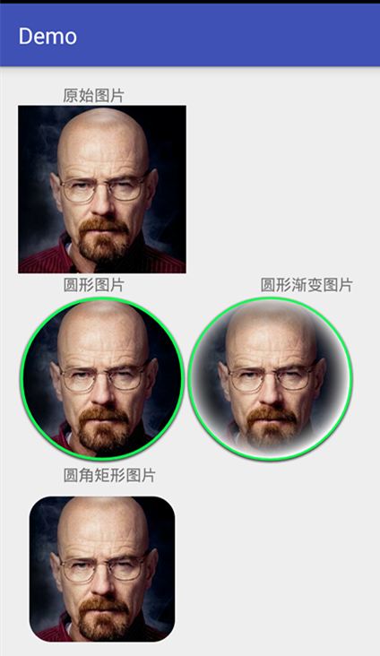
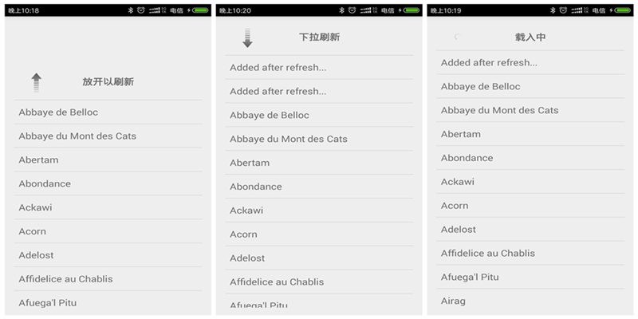
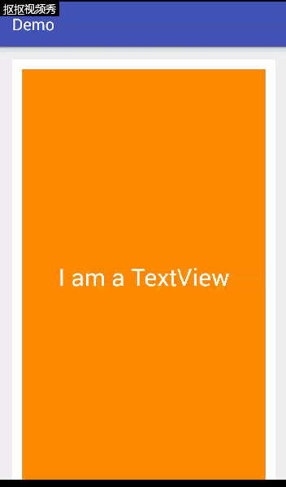

# AndroidDemo
---------------------------------------------------------------------
## SwipeMenuListView
</br>
(1) simple swipe menu listview


</br>
(2) diff menu swipe listview
</br>


</br>
csdn blog:
</br>
http://blog.csdn.net/hfreeman2008/article/details/53350339
</br>
https://github.com/baoyongzhang/SwipeMenuListView

</br>
---------------------------------------------------------------------
## customer image:



csdn blog:
</br>
http://blog.csdn.net/hfreeman2008/article/details/53381156
</br>
github:
</br>
https://github.com/lopspower/CircularImageView
</br>
---------------------------------------------------------------------
##auto scroll view pager


</br>
github:
</br>
https://github.com/Trinea/android-auto-scroll-view-pager
</br>
csdn blog:
</br>
http://blog.csdn.net/hfreeman2008/article/details/53433364
</br>

---------------------------------------------------------------------
##pull to refresh 1

</br>
github:
</br>
https://github.com/johannilsson/android-pulltorefresh
</br>
http://blog.csdn.net/hfreeman2008/article/details/53504099
</br>

---------------------------------------------------------------------
##pull to refresh 2

</br>
github:
</br>
https://github.com/liaohuqiu/android-Ultra-Pull-To-Refresh
</br>
http://blog.csdn.net/hfreeman2008/article/details/53504106
</br>
usage:
</br>
1.app/build.gradle
```xml
//add for pull to refresh 2
compile 'in.srain.cube:clog:1.0.2'
compile 'in.srain.cube:cube-sdk:1.0.44.39-SNAPSHOT@aar'
compile 'in.srain.cube:ultra-ptr:1.0.11'
```

2.build.gradle
```xml
allprojects {
    repositories {
        jcenter()
        //add for pull to refresh 2
        mavenCentral();
        maven {
            url 'https://oss.sonatype.org/content/repositories/snapshots'
        }
    }
}
```