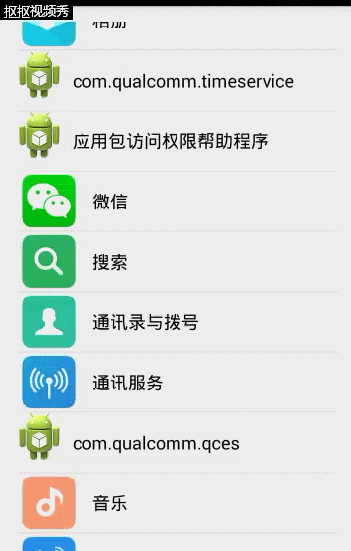

# AndroidDemo

## SwipeMenuListView
 
(1) simple swipe menu listview

 
(2) diff menu swipe listview
 

 
csdn blog:
 
http://blog.csdn.net/hfreeman2008/article/details/53350339
 
https://github.com/baoyongzhang/SwipeMenuListView

 
## customer image:

csdn blog:
http://blog.csdn.net/hfreeman2008/article/details/53381156

##auto scroll view pager

https://github.com/Trinea/android-auto-scroll-view-pager